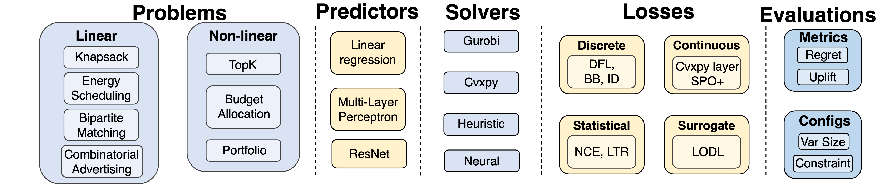

# Towards Better Benchmarking for Decision-Aware Learning

Code and results for:

> **Towards Better Benchmarking for Decision-Aware Learning**
> Kyle Heuton and Michael C. Hughes
> Under review at Transactions on Machine Learning Research (TMLR), 2026.

This repository benchmarks **Predict-then-Optimize** (PtO, "two-stage") against
**Predict-and-Optimize** (PnO, "decision-aware") training for predictive
combinatorial optimization: a neural network predicts the unknown coefficients of
an optimization problem, and methods differ in whether the network is trained to
minimize prediction error or downstream decision regret. It is a re-run of and
extension to the open-source benchmark of
[Geng et al.](https://github.com/Thinklab-SJTU/PredictiveCO-Benchmark)
(NeurIPS 2024, Datasets and Benchmarks Track), covering **14 tasks x 17 methods** with a two-phase
hyperparameter sweep (learning rate x batch regime, then method-specific
hyperparameters), 10 model-init seeds per configuration, and validation-regret
model selection throughout. The paper reports a 12-method x 12-task subset; the
sweep results for all cells ship with the repo as JSON, so every figure and table
in the paper regenerates in minutes without retraining anything.



The package (`openpto`) is modular: **problems** (dataset + objective +
decision evaluation), **solvers** (Gurobi / cvxpy / heuristic / neural),
**losses** (the PtO/PnO methods), and **prediction models** are assembled by
`experiments/main_results.py`.

## Installation

```bash
git clone https://github.com/kheuton/DecisionAwareBenchmarking.git
cd DecisionAwareBenchmarking
conda env create -f environment.yml && conda activate openpto
```

or, into an existing Python >= 3.10 environment:

```bash
pip install -e .
```

Notes:

- `gurobipy` installs without a license, but *solving* the Gurobi-backed tasks
  (knapsack-real, energy) requires one (free academic licenses are available).
- GPU PyTorch is only needed for the Warcraft shortest-path task
  (`shortestpath`, ResNet18 on map images); every other task trains on CPU.
- Regenerating the paper figures/tables (Tier 1 below) needs none of the above —
  the default CPU environment is sufficient.

## Data

All datasets live under `openpto/data/` (see
[`openpto/data/README.md`](openpto/data/README.md) for full per-dataset detail).

- **Shipped with the repo** (~9 MB): the three spatiotemporal top-K datasets
  `asurv`, `cook_county`, and `speed_humps` (fixed train/valid/test CSV splits).
- **Synthetic — no data needed**: `knapsack` (gen), `cubic`, `sp_synth`,
  `sp_planted`, and `pg_misspec` generate their data on first run.
- **Upstream benchmark data**: `knapsack-real`, `energy`, `budgetalloc`,
  `bipartitematching`, and `portfolio` read the data distributed with the
  Geng et al. benchmark. Download the zip from
  [Google Drive](https://drive.google.com/file/d/10OQLzWS5b4EEEFjPc4YeVhxQ_021GoWW/view?usp=sharing)
  and unzip it into `./openpto/data/`.
- **Warcraft shortest path** (`shortestpath`): *not* in the zip above. This is
  the Warcraft 12x12 shortest-path dataset of Vlastelica et al. (ICLR 2020);
  place its `12x12/` directory at `openpto/data/shortestpath/12x12/`
  (expected files: `{train,val,test}_{maps,shortest_paths,vertex_weights}.npy`).
  See the data README for download guidance.

Problem instances are cached as pickles under `saved_problems/` on first load;
pass `--loadnew True` to force regeneration.

## Reproducing the paper

### Tier 1 — figures and tables from bundled results (minutes, no cluster)

The sweep's selected results are committed at the repo root
(`bench_p1_best_val.json`, `bench_p2_best_val.json`, `loss_matrix.json`,
`rank_counterfactual_cache.json`). To regenerate every generated paper artifact
into `results/figures/` and `results/tables/`:

```bash
make all          # = make tables figures (hp-table runs as part of tables)
```

| Paper artifact | Command | Output |
|---|---|---|
| Bump charts, not-recommended tasks (`fig_bench_bump_not_recommended_bootstrap_cropped.pdf`) | `python experiments/fig_bench_bump_not_recommended.py` | `results/figures/fig_bench_bump_not_recommended_bootstrap.pdf` |
| Bump charts, recommended tasks (`fig_bench_bump_recommended_main_bootstrap_cropped.pdf`, `fig_bench_bump_recommended_spatial_bootstrap.pdf`) | `python experiments/fig_bench_bump_recommended.py` | `results/figures/fig_bench_bump_recommended_{main,spatial}_bootstrap.pdf` |
| Portfolio panel (`fig_bench_bump_bootstrap_portfolio.pdf`) | `python experiments/fig_bench_bump_bootstrap.py` | `results/figures/fig_bench_bump_bootstrap_portfolio.pdf` |
| pg_misspec DGP illustration (`synthetic_data.pdf`) | `python experiments/fig_synthetic_data.py` | `results/figures/synthetic_data.pdf` |
| Tuning-benefit tables (`tabapp_tuning_benefit.tex`, `tab_tuning_benefit_summary.tex`) | `make tables` (see `Makefile` for the full flags) | `results/tables/notrec-rec-geo-spw_regret_change_{,by_group_}mean_paper.tex` |
| Error grid (`error_per_problem.tex`) | `make tables` | `results/tables/error_per_problem.tex` |

Details, including which paper files were hand-edited after generation (captions
only — data rows match) and which are hand-maintained, are in
[`REPRODUCING.md`](REPRODUCING.md).

### Tier 2 — retraining from scratch

A single run uses the fixed benchmark protocol
(`--seed 2023 --n_epochs 300 --patience 40 --pred_model dense --n_ptr_epochs 0`),
for example:

```bash
python experiments/main_results.py \
  --problem knapsack --opt_model mse --solver heuristic \
  --seed 2023 --n_epochs 300 --patience 40 --pred_model dense --n_ptr_epochs 0 \
  --lr 1e-2 --prefix demo
```

Outputs (logs, checkpoints, `results.npy`) land under `saved_records/`. The full
two-phase sweep (~22,000 runs including 10 seeds per configuration) is submitted
via `slurm/submit_bench_p1.sh` and `slurm/submit_bench_p2.sh` and collected with
`experiments/collect_bench_p1.py` / `experiments/collect_bench_p2_val.py`. Per-task
instance counts, solver choices, batch-arm semantics, and known caveats are all
specified in [`REPRODUCING.md`](REPRODUCING.md) — the instance counts and solvers
there are load-bearing for comparability and must not be changed.

## Best hyperparameters

The selected (learning rate, batch regime, method-specific hyperparameter) per
method x task — as chosen by minimum 10-seed-mean validation decision regret —
is tabulated in [`results/tables/best_hyperparams.md`](results/tables/best_hyperparams.md)
(also `.csv` and `.tex` alongside), regenerated by:

```bash
python experiments/table_best_hyperparams.py    # or: make hp-table
```

## Repository layout

```
.
├── openpto/                       # the benchmark package
│   ├── problems/                  # 14 decision problems (PTOProblem subclasses)
│   ├── method/
│   │   ├── Models/                # PtO/PnO training losses (the 17 methods)
│   │   ├── Solvers/               # gurobi / cvxpy / heuristic / neural solvers
│   │   └── Predicts/              # prediction nets (dense MLP, ResNet18, ...)
│   ├── expmanager/                # train/eval loop, checkpointing, selection
│   ├── config/                    # per-problem and per-method YAML configs
│   └── data/                      # datasets (see openpto/data/README.md)
├── experiments/                   # main entrypoint + figure/table/collect scripts
├── slurm/                         # Phase-1/2 sweep submitters (SLURM)
├── scripts/                       # one-time data prep (speed_humps)
├── tests/                         # unit tests for the DPO implementation
├── results/                       # committed final figures and tables
│   ├── figures/
│   └── tables/
├── resource/figs/                 # framework diagrams
├── bench_p1_best_val.json         # Phase-1 winners (val-selected)
├── bench_p2_best_val.json         # Phase-2 winners — read by all figure scripts
├── loss_matrix.json               # prediction loss + decision regret per cell
├── rank_counterfactual_cache.json # cache for the tuning-benefit tables
├── Makefile                       # make all / tables / figures / hp-table / test
├── environment.yml                # conda env (name: openpto)
├── pyproject.toml, requirements.txt
└── REPRODUCING.md                 # full retraining + per-deliverable detail
```

## Methods (17)

PtO methods train with a prediction loss; PnO methods train against (a surrogate
of) the decision objective. Method names below are the `--opt_model` values.

| Method | Type | Description | Reference |
|---|---|---|---|
| `mse` | PtO | Two-stage least squares; model selected on validation decision regret | Wilder et al. (2019) |
| `mse_train` | PtO | As `mse`, but selected on training MSE (never calls the solver during training) | this paper |
| `mse_val` | PtO | As `mse`, but selected on validation MSE | this paper |
| `dfl` | PnO | "DFL by Wilder et al.": differentiates the post-solver cost only, MSE-regularized with weight alpha | Wilder et al. (2019) |
| `identity` | PnO | Replaces the solver's backward pass with the identity map | Sahoo et al. (2022) |
| `spo` | PnO | SPO+: convex upper bound on regret with naturally non-zero gradients | Elmachtoub & Grigas (2022) |
| `blackbox` | PnO | Linearly interpolated solver gradients, interpolation step lambda | Vlastelica (Pogancic) et al. (2020) |
| `nce` | PnO | Noise-contrastive estimation over a cache of sampled solutions | Mulamba et al. (2021) |
| `pointLTR` | PnO | Pointwise learning-to-rank over the solution cache | Mandi et al. (2022) |
| `pairLTR` | PnO | Pairwise learning-to-rank over the solution cache | Mandi et al. (2022) |
| `listLTR` | PnO | Listwise learning-to-rank, softmax temperature tau | Mandi et al. (2022) |
| `lodl` | PnO | Locally Optimized Decision Losses: learned surrogate loss fit from sampled perturbations | Shah et al. (2022) |
| `perturb` | PnO | DPO: differentiable perturbed optimizer (soft decision via Gaussian perturbations, sigma, n_samples) | Berthet et al. (2020) |
| `pg` | PnO | Perturbation Gradient: deterministic finite-difference surrogate of the decision loss, width sigma | Huang et al. (2024) |
| `qptl` | PnO | Quadratic-programming task loss: differentiates a quadratically regularized LP via KKT | Wilder et al. (2019) |
| `cpLayer` | PnO | Differentiable convex-optimization layer (cvxpylayers) | Agrawal et al. (2019) |
| `dad` | PnO | Decision-Aware Denoising: Stein-corrected in-sample objective, weight `stein_weight` | Gupta et al. (2024) |

Applicability limits: `qptl`/`cpLayer` run only on knapsack, bipartitematching,
and portfolio (LP/QP structure required); `pg` runs on all tasks except
`shortestpath`. The paper's reporting set is the 12 methods excluding
`mse_train`, `mse_val`, `dad`, `qptl`, and `cpLayer`.

## Tasks (14)

`--problem` names; instance counts and solvers are part of the fixed protocol
(full table with per-task flags in `REPRODUCING.md`).

| Task | Description | Train / test instances | Solver |
|---|---|---|---|
| `knapsack` | 2-D knapsack, synthetic profits | 400 / 200 | `heuristic` (DP) |
| `knapsack-real` | Knapsack on real energy-price data | fixed dataset | `gurobi` |
| `energy` | Energy-cost-aware scheduling (ICON) | fixed dataset | `gurobi` |
| `budgetalloc` | Submodular budget allocation | 400 / 200 | `neural` |
| `cubic` | Cubic top-K (LODL paper task) | 250 / 400 | `heuristic` |
| `bipartitematching` | Bipartite matching on Cora subgraphs | 20 / 6 | `cvxpy` |
| `portfolio` | Markowitz portfolio QP, historical prices 2004-2017 | 400 / 200 | `cvxpy` |
| `asurv` | Aerial-survey site selection (top-K) | fixed: 1338 locations, T=15/6/6 | `heuristic` (TopK) |
| `cook_county` | Cook County overdose-death tract ranking (top-K) | fixed: 1328 tracts, T=4/1/2 | `heuristic` (TopK) |
| `speed_humps` | NYC speed-hump siting (top-K) | fixed: 2107 tracts, T=5/2/4 | `heuristic` (TopK) |
| `sp_synth` | 5x5-grid shortest path, SPO+ paper DGP | 400 / 10000 | `heuristic` (DAG DP) |
| `sp_planted` | 5x5-grid shortest path, planted arcs (PG paper DGP) | 400 / 10000 | `heuristic` (DAG DP) |
| `pg_misspec` | 1-D misspecified sign decision (PG paper Sec. 4.1) | 400 / 10000 (200 train / 200 val) | `heuristic` (BinarySign) |
| `shortestpath` | Warcraft 12x12 image shortest path (ResNet18, GPU) | 10000 / 1000 | `heuristic` (Dijkstra) |

Most paper tables use the 12 tasks excluding `portfolio` (appendix figure only)
and `sp_planted`.

## Tests

```bash
make test          # = python -m pytest -q tests/
```

Two tests compare the DPO implementation against the reference
[perturbations-differential-pytorch](https://github.com/tuero/perturbations-differential-pytorch)
implementation; they skip cleanly unless that repo is cloned into the repo root
(see `REPRODUCING.md`).

## Relationship to the upstream benchmark

This repository is a derivative of
[Thinklab-SJTU/PredictiveCO-Benchmark](https://github.com/Thinklab-SJTU/PredictiveCO-Benchmark)
(Geng et al., NeurIPS 2024), released under the same MIT license. From
upstream: the modular `openpto` framework (problems / solvers / losses /
prediction models), seven benchmark tasks (knapsack synth + energy prices,
energy scheduling, budget allocation, cubic top-K, bipartite matching,
portfolio, Warcraft shortest path), the original method implementations
(two-stage, DFL, SPO+, Blackbox, NCE, the LTR family, LODL, QPTL, cpLayer,
DPO), and the vendored `qpth` solver. New in this work: six tasks (the
spatiotemporal top-K trio, the two synthetic shortest-path grids, and the PG
misspecification task), the PG and DAD methods, the soft-decision DPO
implementation, the MSE selection-signal variants, the two-phase multi-seed
hyperparameter sweep with checkpoint/requeue support, and all analysis, figure,
and table code in `experiments/`.

## License and citation

The code is released under the [MIT License](LICENSE). It extends the
open-source release of Geng et al.'s NeurIPS 2024 benchmark
([Thinklab-SJTU/PredictiveCO-Benchmark](https://github.com/Thinklab-SJTU/PredictiveCO-Benchmark)
/ `openpto`); we thank the authors for making their code and data available.

If you use this repository, please cite both papers:

```bibtex
@article{heuton2026benchmarking,
  title  = {Towards Better Benchmarking for Decision-Aware Learning},
  author = {Heuton, Kyle and Hughes, Michael C.},
  year   = {2026},
  note   = {Under review at Transactions on Machine Learning Research},
}

@inproceedings{geng2024benchmarking,
  title     = {Benchmarking {PtO} and {PnO} Methods in the Predictive Combinatorial Optimization Regime},
  author    = {Geng, Haoyu and Ruan, Hang and Wang, Runzhong and Li, Yang and Wang, Yang and Chen, Lei and Yan, Junchi},
  booktitle = {Advances in Neural Information Processing Systems (Datasets and Benchmarks Track)},
  volume    = {37},
  pages     = {65944--65971},
  year      = {2024},
}
```
